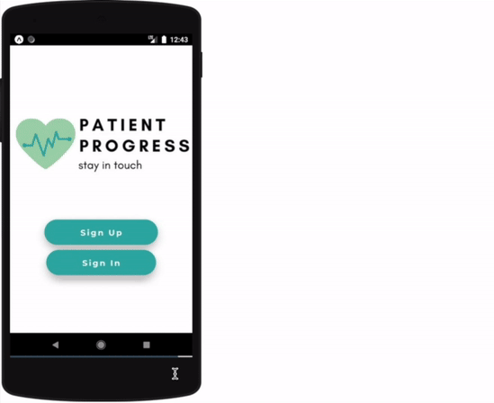
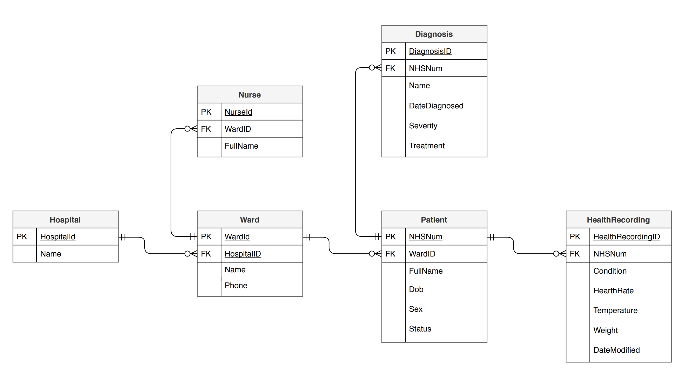

# Patient Progress REST API 👩‍⚕️

This REST API written in Python powers the backend side of the Patient Progress application (frontend was developed using JavaScript, React Native). Patient Progress was created during a month-long CFG Hack from Home 2020 Hackathon and it is an app that automates the process of updating emergency contacts of a patient via an interactive real-time feed.

Patient Progress was designed with the assumption that the medical data will be collected from existing NHS APIs and displayed on the interactive feed. However, for our hackathon demo, we made use of the Patient Progress REST API.

The Patient Progress REST API has no HTML interface and returns raw JSON data. That is kind of boring but you can check out the API-powered feed in action down below 👇.

# Use

The API has two publicly available end points:

- **GET** Patients End Point `api/patients`
- **GET** Patient Detail `api/patients/<nhs_number>`

# Technologies

- Python
- Django and Django REST
- PostgreSQL
- Heroku (Free Tier)

# Preview

# Database Schema

